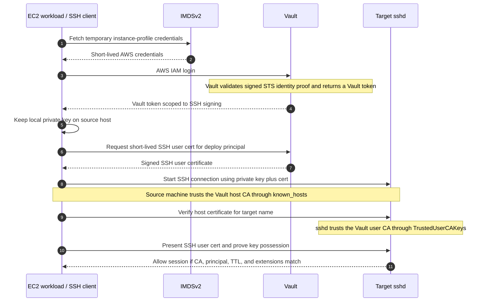

# Vault SSH signed certificate demo

Interactive Docker Compose lab for the Vault SSH secrets engine using the latest Vault Community Edition image.

This demo uses exactly three long-running containers:

- `vault` - Vault Community Edition with two SSH signer mounts
- `linux-server` - OpenSSH server that trusts Vault user certificates and presents a Vault-signed host certificate
- `linux-client` - Linux client used to request certificates from Vault and perform real SSH logins

The demo follows the signed SSH certificate workflow from the HashiCorp documentation:

- user certificates for client authentication
- host certificates for server identity

## What this lab shows

Phase 1: host trust

- Vault signs the server host public key
- the client trusts Vault's host CA
- SSH reaches authentication without a host authenticity prompt

Phase 2: user authentication

- Vault signs the client user public key
- the server trusts Vault's user CA
- the client logs in with a short-lived SSH certificate

## Prerequisites

- Docker
- Docker Compose
- Make
- `python3`
- `curl` for the optional guided demo script

## Quick start

```bash
make setup
make verify
```

Then either:

- run the guided flow with `make demo`
- or run the manual commands below

## Manual demo flow

Open a shell in the client container:

```bash
make shell-client
```

Inside the client shell:

```bash
source /demo/client/demo.env
ssh -o BatchMode=yes -o PreferredAuthentications=none server.demo.internal true
```

That should fail on authentication, but it should not fail on host trust.

Generate a user keypair:

```bash
ssh-keygen -t ed25519 -N '' -f ~/.ssh/id_ed25519
```

Ask Vault to sign the client public key:

```bash
vault write -field=signed_key ssh-client-signer/sign/demo-user \
  public_key=@$HOME/.ssh/id_ed25519.pub \
  valid_principals=demo > $HOME/.ssh/id_ed25519-cert.pub
```

The demo role adds the `permit-pty` extension by default so the signed user
certificate can open an interactive shell.

Inspect the signed certificate:

```bash
ssh-keygen -Lf ~/.ssh/id_ed25519-cert.pub
```

Log in:

```bash
ssh server.demo.internal
hostname
whoami
exit
```

## Why use Vault SSH secrets engine

The main business value is better SSH control with less credential sprawl.
Instead of copying long-lived public keys into `authorized_keys` on many hosts,
you let Vault issue short-lived SSH certificates under central policy.

Typical benefits:

- faster onboarding and offboarding because access is granted by Vault policy
  instead of editing many servers by hand
- lower risk from stolen laptops or leaked keys because a short-lived
  certificate expires quickly
- centralized rules for who can access what, for how long, and with which SSH
  capabilities
- a clean audit trail of certificate issuance in Vault
- easier separation between production and non-production access
- fewer stale keys and less `authorized_keys` drift on servers

### Centralized rules for who can access what

Without Vault, every server can become its own source of truth for SSH access.
Different hosts may have different `authorized_keys` files, different local
practices, and different levels of cleanup. Over time that creates drift.

With Vault SSH certificates, the server usually trusts a small number of CA
keys once, and Vault decides who is allowed to receive a certificate. That
policy can include:

- principals such as which Unix account may be used
- TTL such as whether access lasts minutes or hours
- extensions such as `permit-pty` or port forwarding permissions
- environment-specific roles such as `dev-admin`, `prod-readonly`, or
  break-glass access

That changes the operational question from "does this host still have Alice's
public key?" to "is Alice allowed to get a `prod-admin` certificate right now
under policy?" That is much easier to govern, review, and audit consistently.

### What an issued certificate looks like

You can inspect a signed user certificate with:

```bash
ssh-keygen -Lf ~/.ssh/id_ed25519-cert.pub
```

Example shape:

```text
/home/demo/.ssh/id_ed25519-cert.pub:
        Type: ssh-ed25519-cert-v01@openssh.com user certificate
        Public key: ED25519-CERT SHA256:...
        Signing CA: RSA SHA256:...
        Key ID: "alice-prod-admin"
        Serial: 660640397678247333
        Valid: from 2026-03-25T23:25:59 to 2026-03-25T23:56:29
        Principals:
                demo
        Critical Options: (none)
        Extensions:
                permit-pty
```

Important fields:

- `Signing CA` shows which trusted CA signed the certificate
- `Valid` shows the short-lived access window
- `Principals` shows which login names the certificate may use
- `Extensions` shows which SSH capabilities are allowed

This is where Vault policy becomes visible on the credential itself. In this
demo, for example, the certificate is signed by the Vault user CA, is only
valid for a short period, is limited to the `demo` principal, and includes
`permit-pty` so the user can open an interactive shell.

## Machine-to-machine SSH flow

For machine-to-machine SSH, the basic pattern is the same as the human-user
flow in this demo, but the client is a workload instead of a person.



There is also a standalone visual explainer for this flow at
`artifacts/vault-aws-ec2-machine-ssh-flow.html`. From the repo root on macOS,
open it with:

```bash
open artifacts/vault-aws-ec2-machine-ssh-flow.html
```

End to end:

1. The source machine keeps its own SSH private key locally.
2. The source machine authenticates to Vault using a workload identity such as
   Kubernetes, AppRole, AWS IAM, or another machine identity method.
3. Vault checks policy and signs the machine's public key, returning a
   short-lived SSH user certificate.
4. The target server already trusts the Vault user CA through
   `TrustedUserCAKeys`.
5. The client connects and verifies the server's host certificate using the
   Vault host CA.
6. The client presents the signed user certificate and proves possession of the
   matching private key.
7. `sshd` checks the CA signature, principal, TTL, and extensions, then allows
   or denies access.

The main operational model is usually a relatively stable local keypair plus a
short-lived Vault-issued certificate.

### How host verification works

When the client connects, it must first decide whether the server is really the
intended host. In this demo, that trust comes from a host CA instead of from
pinning one raw host key per machine.

The flow is:

- Vault signs the server's host public key
- the server presents that host certificate during SSH
- the client trusts the Vault host CA public key
- the client verifies that the host certificate was signed by that CA, is still
  valid, and includes the expected hostname such as `server.demo.internal`

This is why the client can trust the server without learning one separate raw
host key for each server.

### What `known_hosts` is doing here

In this demo, the client learns the Vault host CA public key from
`~/.ssh/known_hosts`. The relevant entry has this shape:

```text
@cert-authority *.demo.internal <Vault host CA public key>
```

That line means:

- `@cert-authority` says the key on the line is a CA key, not a normal host key
- `*.demo.internal` is the hostname pattern this CA is allowed to vouch for
- the final field is the Vault host CA public key itself

So OpenSSH interprets the line as: trust host certificates for
`*.demo.internal` if they were signed by this CA.

In this repo, `init.sh` writes that entry into `shared/client/known_hosts`, and
the client container links it to `~/.ssh/known_hosts`. In a real deployment,
that CA trust is usually distributed through endpoint management, image baking,
or config management instead of being edited by hand on every client.

## Protecting the client key

In this demo, the file-based SSH keypair is usually generated once on the
client, while the Vault-issued SSH certificate is renewed whenever it expires.
The demo role currently issues short-lived certificates with a 30 minute TTL.

Longer-lived private keys increase the risk window if the key is copied from
disk, a backup, or a compromised workstation. Short-lived Vault certificates
limit that exposure because the certificate expires quickly even if it is
stolen.

For a real workstation, a strong pattern is:

- keep a long-lived client key protected locally
- use short-lived Vault-issued SSH certificates
- rotate the underlying keypair only when the device changes, the key is
  compromised, or policy requires it

### Touch ID on macOS

Touch ID is mainly about protecting use of the local key, not regenerating the
keypair. A practical macOS setup is:

- create a passphrase-protected SSH key
- let `ssh-agent` and the Apple Keychain remember it
- rely on macOS login, screen lock, FileVault, and Touch ID to protect access

Example SSH config:

```sshconfig
Host *
  AddKeysToAgent yes
  UseKeychain yes
```

This gives a good user experience, but the private key still exists as a file
on disk.

### FIDO2 security keys

FIDO2-backed SSH keys are stronger because the private key stays on a hardware
token instead of being stored as a normal file. OpenSSH supports hardware-backed
`ed25519-sk` and `ecdsa-sk` keys.

Typical benefits:

- the private key is usually non-exportable
- key use can require touch and optionally a PIN or user verification
- stealing `~/.ssh` is not enough to steal the private key

Example flow on macOS with a FIDO2 authenticator:

```bash
ssh-keygen -t ed25519-sk -O verify-required -f ~/.ssh/id_ed25519_sk

vault write -field=signed_key ssh-client-signer/sign/demo-user \
  public_key=@$HOME/.ssh/id_ed25519_sk.pub \
  valid_principals=demo > $HOME/.ssh/id_ed25519_sk-cert.pub

ssh -i ~/.ssh/id_ed25519_sk \
  -o CertificateFile=~/.ssh/id_ed25519_sk-cert.pub \
  server.demo.internal
```

That combination is often the best production pattern for human users:
hardware-backed private key plus short-lived Vault-signed SSH certificates.
Keep a backup security key enrolled as well so device loss does not lock you
out.

## Available commands

- `make setup` - build containers, start services, and bootstrap Vault
- `make verify` - verify Vault and generated trust material
- `make demo` - run the guided terminal demo
- `make shell-client` - open a shell in the client container as `demo`
- `make shell-server` - open a shell in the server container
- `make shell-vault` - open a shell in the Vault container
- `make reset` - tear down and recreate the lab
- `make clean` - remove containers, volumes, and generated files

## Generated files

Bootstrap writes files into:

- `artifacts/vault-init.json` - Vault init output for this local lab
- `shared/server/` - server trust files and host certificate
- `shared/client/` - client trust files and Vault environment helper

These files are only for the local demo lab.

## Architecture notes

- Vault runs two signer mounts on one CE server:
  - `ssh-client-signer`
  - `ssh-host-signer`
- the server keeps its host private key locally
- the client keeps its user private key locally
- no extra OTP helper is used because this lab is certificate-based
- `docker exec` is only for setup and inspection, not for the login demo path

## Reference

- https://developer.hashicorp.com/vault/docs/secrets/ssh/signed-ssh-certificates
